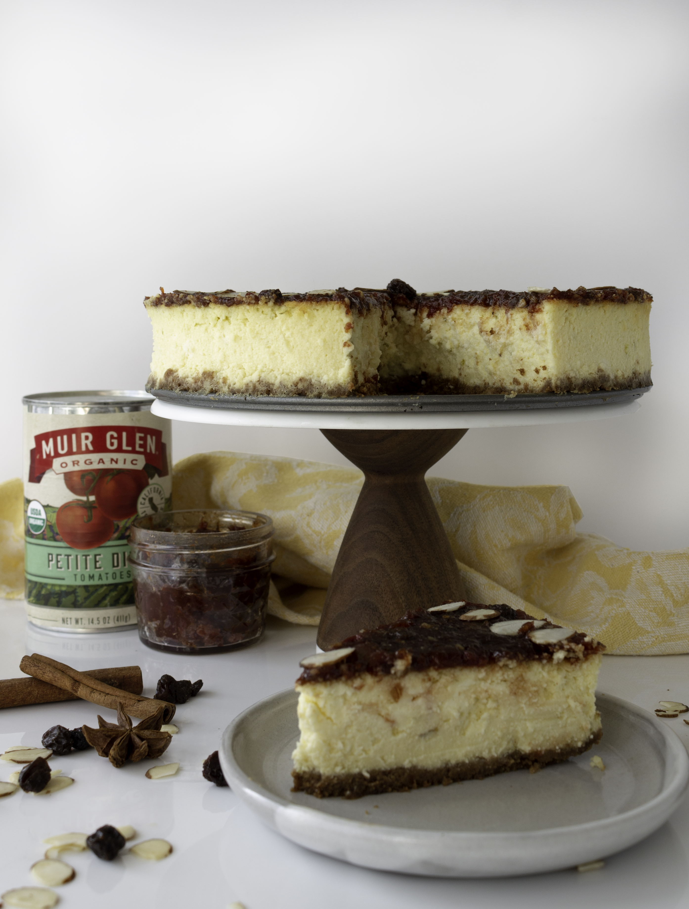
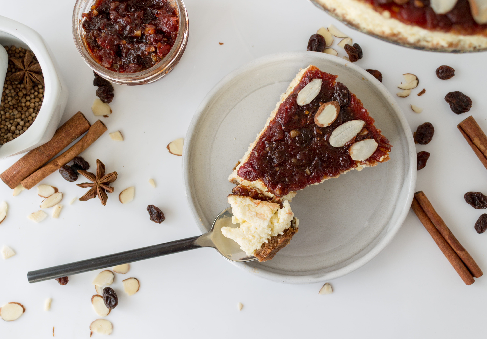

---
title: Mexican Ricotta Cheesecake with Tomato Mole Jam
description: Mexican Ricotta Cheesecake with Tomato Mole Jam
date: '2019-01-24'
image: ./mole_cheesecake-13.jpg
tags: [cheesecake, cake]
------

The first month of the New Year has already flown by and it’s bitter cold here in Brooklyn.  Even though winter is always fun (ie. skiing), I get that yearning to be on a beach in Mexico or basking in the Mediterranean sun whenever I am trudging to work through the snowy dirty streets of New York.  Making and eating this Mexican Ricotta Cheesecake with a Tomato Mole Jam is possibly the next best thing to hopping on a flight to warmer weather.  It has loads of spicy, complex flavors that will keep you warm and preoccupied until the sun comes out in a few months. 

When i was approached by Muir Glen and The Feedfeed to develop a recipe for them using their organic canned tomatoes, I wanted to think outside the box. Wanting to stay true to my *mostly* dessert feed, a tomato jam immediately came to mind. Tomato jams are usually made with onions, cumin and other savory spices. They show up on cheese plates, as condiments for sandwiches, on top of eggs and in vinaigrettes.  I wanted to make a more complex, sweeter jam that could do double duty as a perfect addition to a cheese plate but not feel weird on top of a dessert. Mole is a traditional sauce used in Mexican cuisines. According to Wikipedia - the source of all knowledge - a mole sauce contains a fruit, chili pepper, nut, and such spices as black pepper, cinnamon, cumin, and chocolate.  I could work with that. As you can see in the final recipe below, my mole jam has a lot of that - cinnamon, dried fruit, almonds and cocoa. The results? A sweet, (but not too sweet!) dynamic, interesting jam with a slightly spicy aftertaste.  It tastes like a tomato jam, but it also doesn’t really taste a whole lot like what you would think tomatoes taste like.  But what do I put it on? 

    

        
    

    

        
    

Enter the ricotta cheesecake. Using ricotta in place of some of the cream cheese makes the cake a lot lighter (in a calorie and fluffier way). This creates a good balance with the graham cracker crust and thick dense mole jam.  By using the tried and true water bath method (outlined in the instructions), my cheesecake came out perfect with no cracks, no overcooked edges and a flat top!  I also left it in the oven after I turned off the heat for a few hours, which I’ve read helps prevent cracking.

I ventured to my local co-op to buy the tomatoes, spices and other ingredients for this recipe.  Flatbush Food Coop is the closest one to me, but you can find your closest one here! The tomatoes are currently on sale for 10/$10 - which is very exciting because that’s almost half their regular price. Speaking of deals (which I’m a huge fan of), the entire co-op was extremely reasonably priced and they had an extensive bulk food and spice section where you can get just what you need (like for this recipe!). 

This cake is perfect when you want to try making something different.  The jam itself is a showstopper and I can imagine it works very well with all sorts of cheese, on top of your morning bagel and cream cheese, inside a pastry or mixed into yogurt.   The jam makes a little more than you actually need to cover the cake, so let me know if you make this recipe and what you did with the extra!

### Mexican Ricotta Cheesecake with Tomato Mole Jam

#### Tomato Mole Jam
_Makes 1 4oz jar_

##### __**Ingredients**__
- 1 14.5oz can [Muir Glen Petite Diced Tomatoes](https://www.muirglen.com/products/petite-diced-tomatoes/)
- 1 cup sugar _(7 oz / 200g)_
- 2 dates, finely chopped
- ¼ cup raisins, finely chopped
- 2 Tbsp almonds, finely chopped
- 1-2 cinnamon sticks
- 1 whole or ¼ tsp ground star anise _(optional)_
- Juice and zest from 1 lime
- 1 Tbsp cocoa powder
- ¼ - ½ tsp chili powder _(depending on how spicy you want it)_
- ⅛ tsp cayenne pepper
- ¼ tsp nutmeg
- ¼ tsp cloves

##### __**Directions**__
Drain the tomatoes in a mesh strainer to remove any extra juice. Place tomatoes and rest of the ingredients in a medium-sized saucepan.

Heat on low and stir frequently until the sugar has dissolved.  Increase the heat to medium and bring the jam to a boil, stirring frequently with a wooden spoon.  Let it cook at a medium boil for 15-20 minutes, stirring every minute or so to prevent the sides and bottom from burning.  At 15 minutes, test the jam.  It should have a thick gelatinous consistency.  

Once the jam is done, remove cinnamon sticks and whole star anise.  The jam will be kind of chunky with the dried fruit and nuts.  If you prefer a smoother jam, use an immersion blender stick to puree it a bit.  You can also put it in a food processor or blender.  Afterwards, quickly pour jam into a glass ball jar and seal it.  Let it completely cool at room temperature.  It should last up to 4 months refrigerated. 

If you are making this jam on its on and wish to preserve it unrefrigerated, follow steps [here](https://www.nytimes.com/2012/09/19/dining/canning-jam-from-preparing-the-jars-to-testing-the-seal.html) for prepping the jar.

______________________________________________

#### Ricotta Cheesecake
_Makes 1 8-inch cake, about 10-12 servings_

##### __**Ingredients**__
###### Crust
- 1 cup Graham Cracker crumbs _(100g, or from ~7 crackers)_
- 3 Tbsp butter, melted
- 1 Tbsp cinnamon
- ⅛ tsp cayenne
- ¼ tsp ginger

###### Cake
- 32 oz ricotta, drained _-- then will be more like 27 oz_
- 8 oz cream cheese
- 1 cup sugar
- 4 eggs
- 2 Tbsp all-purpose flour
- 2 Tbsp cornstarch
- 1 Tbsp lime juice _(juice from 1 lime)_
- Zest of 1 lime
- 1 tsp vanilla extract
- ½ tsp almond extract _(optional)_
- ¼ tsp salt

- Tomato Mole Jam, _recipe above_
- Slivered Almonds _for garnish, optional_

##### __**Directions**__
Preheat the oven to 350˚F / 180˚C. Butter a 8-inch springform pan.

Place the ricotta cheese in either a cheesecloth on top of a mesh strainer or in a fine mesh strainer, and put the strainer over a bowl.  Let it sit for at least 30 minutes, or up to 2 hours to drain the cheese, since it’s usually pretty watery.

If not using packaged graham cracker crumbs, put the graham crackers in a food processor and pulse until fine.  You can also put the crackers in a ziploc bag and smash them.  Add the melted butter and spices in the food processor and pulse a few times to just mix. Pour the crumbs into the pan and press into an even layer.  Using the bottom of a glass helps!

Bake the crust for 8-10 minutes, or until golden brown. Once completely cooled, wrap the base of the springform pan in 1-3 layers of tinfoil.  This is so the water from the water-bath doesn’t seep into the cake. 

Lower the oven to 325˚F / 160˚C.

Using a electric mixer with a paddle attachment (or by hand if you don’t have a mixer), beat the cream cheese on medium-low until smooth, 1-2 minutes.  Add ricotta and sugar, and beat until smooth. One at a time, add in the eggs until fully incorporated. Add the flour, cornstarch, extracts, salt, lime juice and zest and mix until just combined and a smooth consistency.  Pour batter over the crust and spread evenly.

Place the pan on a roasting pan and put in the oven.  Boil some water.  Once in the oven, pour boiling water into the pan so that it covers about 1/2 up the side of the pan, 1-1.5 inches high.  Trust me, it’s a lot easier and safer to pour the water in after it’s in the oven than trying to carefully put it on the rack with splashing hot water going everywhere.

Bake for approximately 1.25-1.5 hours. It is done when you can shake the pan and the sides of the cake are set but the center is slightly wiggly, about the size of an inch in diameter. . That’s fine.  Turn off the oven and leave it in the oven for 3 hours with the door closed the entire time.  Take it out and leave it on the counter for another 1-2 hours. Refrigerate (tightly wrapped in plastic wrap) until ready to use, preferably overnight.

##### __**Assembly**__
When ready to serve, spread the Tomato Mole Jam on top of the cake.  I like to do this while it is still in the springform pan to get nice sharp edges around the side.  Decorate with slivered almonds if desired.  Run a butter knife around the edges of the cake and release it from the pan. Cake can be kept in the refrigerator for up to 5 days. 

